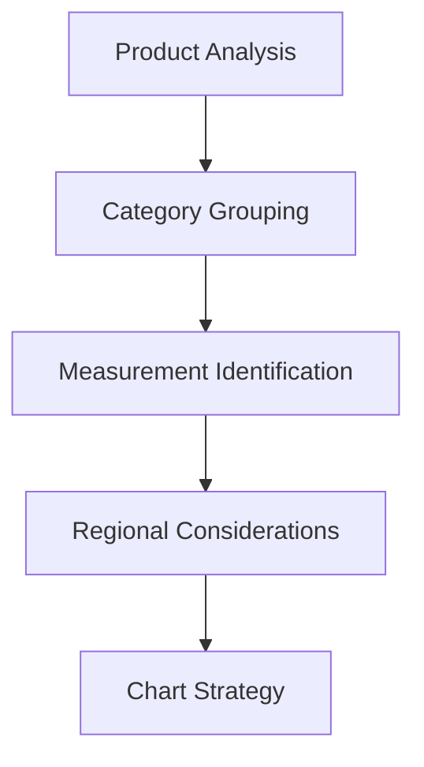

# 📐 Advanced Size Chart Creation Guide

> **Master the art of creating size charts that convert!** This comprehensive guide covers everything from basic table creation to advanced customization techniques. Learn how to build size charts that not only inform customers but actually increase sales and reduce returns.

Size charts are more than just measurement tables – they're powerful conversion tools that build customer confidence and reduce purchase anxiety. When implemented correctly, they can significantly decrease return rates while increasing average order value. Our advanced creation system makes it easy to build professional, accurate size charts that integrate seamlessly with your Shopify store.

The key to successful size charts lies in understanding your customer's mindset and providing clear, actionable information. Customers want to feel confident about their purchase, and a well-designed size chart can be the difference between a sale and an abandoned cart.


## 📋 Table of Contents

- [Planning Your Strategy](#-planning-your-strategy)
- [Chart Creation Process](#-chart-creation-process)
- [Data Management](#-data-management)
- [Advanced Features](#-advanced-features)
- [Testing & Optimization](#-testing--optimization)
- [Industry Best Practices](#-industry-best-practices)

## 🎯 Planning Your Strategy

### Understanding Your Product Categories

Different product types require fundamentally different approaches to size charting. Clothing items need body measurements, while accessories focus on dimensions and fit preferences. Footwear requires length, width, and sometimes height considerations, especially for boots and athletic shoes.

Before creating your first chart, analyze your product catalog and identify the main categories. Group similar items together and understand the key measurements that matter most to your customers. This strategic approach will save you time and ensure consistency across your store.

Research your target market's sizing expectations and regional preferences. European customers expect different size ranges than North American customers, and Asian markets often use completely different sizing systems. Consider creating region-specific charts if you serve international markets.



### Market Research & Customer Analysis

Understanding your customers is crucial for creating effective size charts that actually get used. Study your customer demographics, geographic distribution, and shopping behaviors to inform your chart design decisions. Analyze your return data to identify common sizing issues and patterns.

Survey your existing customers about their sizing preferences and pain points. Ask about their measurement habits, preferred units (metric vs. imperial), and what information they find most helpful when making sizing decisions. Use this data to guide your chart creation process.

Look at competitor size charts in your niche for inspiration and to identify industry standards. Note what works well and what could be improved, but always prioritize your customers' specific needs over copying others' approaches.

| Research Area | Key Questions | Data Sources |
|---------------|---------------|-------------|
| **Demographics** | Age, gender, location distribution | Analytics, surveys |
| **Behavior** | How do customers measure? | User interviews, support tickets |
| **Preferences** | Units, detail level, visual vs. text | A/B testing, feedback |
| **Pain Points** | Common sizing mistakes | Return data, reviews |

## 🛠️ Chart Creation Process

### Step 1: Template Selection & Customization

Our template system provides professionally designed starting points for different product categories. Choose from clothing, footwear, accessories, or jewelry templates, each optimized for their specific measurement requirements. Templates include proper measurement labels, unit conversions, and mobile-responsive layouts.

Customize your chosen template to match your brand's visual identity and specific product needs. Adjust colors, fonts, and spacing to align with your store's design language. Consider your customers' technical comfort level – some audiences prefer detailed measurements while others want simplified guidance.

Don't feel locked into a single template approach. You can create multiple chart variations for different product lines or customer segments. Premium products might warrant more detailed charts, while basic items could use simplified versions.

```html
<!-- Example template structure -->
<div class="size-chart-container">
  <div class="chart-header">
    <h3>Size Guide</h3>
    <div class="unit-toggle">
      <button data-unit="cm">CM</button>
      <button data-unit="inches">INCHES</button>
    </div>
  </div>
  <table class="size-table">
    <!-- Chart content -->
  </table>
</div>
```

### Step 2: Measurement Definition & Input

Accurate measurements form the foundation of any effective size chart. Start by defining exactly what each measurement represents – chest circumference, waist circumference at natural waistline, hip circumference at fullest part, etc. Provide clear measurement instructions for each dimension.

Input your measurements systematically, starting with the smallest size and working up. Use consistent measurement techniques and tools to ensure accuracy across all sizes. Consider hiring a professional pattern maker or fit specialist if you're working with complex garments or high-value items.

Build in appropriate ease allowances for different garment types. A fitted dress requires different ease than a relaxed sweater, and your size chart should reflect these differences. Document your ease calculations so you can maintain consistency across product lines.

> **💡 Pro Tip:** Always measure actual garments rather than relying on manufacturer specs. Garment measurements can vary significantly from pattern measurements due to fabric behavior and construction techniques.

### Step 3: Size Range Development

Develop size ranges that serve your actual customer base, not theoretical standards. Analyze your sales data to understand which sizes sell most frequently and ensure these are well-represented in your charts. Consider adding extended sizes if there's demand in your market.

Create logical size progressions with consistent increments between sizes. Most clothing categories work well with 2-4 cm (1-2 inch) increments, but this varies by garment type and target fit. Athletic wear often requires smaller increments than casual clothing.

Consider offering half-sizes or intermediate sizes in categories where fit is critical. Bras, shoes, and tailored garments often benefit from more granular size options. Balance this with inventory management complexity – more sizes mean more SKUs to manage.

```json
{
  "sizeProgression": {
    "clothing": {
      "increment": "4cm",
      "ease": "2-8cm depending on garment",
      "specialCases": ["fitted dresses: 2cm", "outerwear: 8cm"]
    },
    "footwear": {
      "increment": "0.5 size",
      "lengthIncrement": "6.67mm",
      "widthVariations": ["narrow", "regular", "wide"]
    }
  }
}
```

## 📊 Data Management

### Import/Export Capabilities

Our system supports bulk data management through CSV import/export functionality, making it easy to manage large catalogs or update measurements across multiple charts. Use our standardized CSV templates to ensure proper formatting and avoid import errors.

Export your existing charts for backup purposes or to share with manufacturers, designers, or quality control teams. The export function includes all measurement data, size labels, and metadata like creation dates and modification history.

Set up regular backup schedules for your size chart data, especially if you frequently update measurements or add new products. Consider version control for your size charts to track changes over time and revert to previous versions if needed.

```csv
Size,Label,Chest,Waist,Hip,Length,Sleeve,Notes
1,XS,84,64,88,58,59,"Fitted cut"
2,S,88,68,92,60,60,"Regular fit"
3,M,92,72,96,62,61,"Regular fit"
```

### Version Control & History

Maintain detailed records of chart modifications including who made changes, when they were made, and the reason for the change. This audit trail is invaluable for quality control and helps identify patterns in sizing adjustments over time.

Implement approval workflows for chart changes, especially in larger organizations. Require sign-off from relevant stakeholders before publishing updated measurements to prevent errors from reaching customers. Set up automated notifications when charts are modified.

Use A/B testing to evaluate the impact of chart changes on conversion rates and return rates. Track key metrics before and after modifications to ensure changes actually improve customer experience and business outcomes.

## 🚀 Advanced Features

### Conditional Logic & Smart Display

Implement smart display logic that shows different charts based on product attributes, customer location, or device type. For example, show simplified charts on mobile devices while displaying detailed measurements on desktop. This responsive approach improves user experience across all touchpoints.

Create conditional rules that display different size information based on product tags or categories. Athletic wear might emphasize stretch and performance fit, while formal wear focuses on precise tailoring measurements. This contextual approach provides more relevant information to customers.

Set up dynamic sizing recommendations based on customer input. Allow customers to enter their measurements and receive personalized size suggestions with confidence ratings. This feature can significantly reduce sizing uncertainty and increase conversion rates.

```javascript
// Example conditional logic
const getRelevantChart = (product, customer, device) => {
  if (device.mobile && product.category === 'basics') {
    return 'simplified-chart';
  }
  
  if (customer.region === 'EU' && product.type === 'formal') {
    return 'eu-formal-detailed';
  }
  
  return 'standard-chart';
};
```

### Integration with Product Data

Connect your size charts directly to your product catalog for automatic chart assignment based on product attributes. Set up rules that automatically apply appropriate charts to new products based on their category, tags, or other metadata.

Sync with your inventory management system to show size availability alongside measurements. This integration helps customers make informed decisions about both fit and availability, reducing frustration from selecting unavailable sizes.

Create dynamic size charts that adapt to product variations. If you sell the same style in different fabrics or cuts, the chart can automatically adjust measurements and fit descriptions based on the selected variant.

### Multi-Language & Regional Support

Develop localized size charts that adapt to regional sizing conventions and cultural preferences. European customers expect metric measurements and EU sizing, while North American customers prefer imperial measurements and US sizing standards.

Implement automatic language detection and chart localization based on customer location or browser settings. Ensure that not just the language changes, but also the measurement units, size labels, and cultural fit preferences are appropriately adjusted.

Consider creating region-specific measurement guides that account for different body types and fit preferences across markets. Asian markets often prefer looser fits in certain categories, while European markets may prefer more fitted silhouettes.


## 🧪 Testing & Optimization

### A/B Testing Strategies

Implement systematic A/B testing to optimize your size charts for maximum effectiveness. Test different layouts, information density levels, visual vs. text-based instructions, and call-to-action placements. Focus on metrics that matter: conversion rate, return rate, and customer satisfaction.

Create test segments based on customer behavior patterns. New customers might benefit from more detailed guidance, while repeat customers might prefer simplified charts. Test different approaches for different customer segments to optimize the experience for each group.

Document your testing results and create a knowledge base of what works for your specific audience. Share insights across your team and use learnings to inform future chart designs and optimization efforts.

```javascript
// A/B testing framework example
const sizeChartVariants = {
  control: 'standard-table-format',
  variant_a: 'visual-guide-format', 
  variant_b: 'interactive-measurement-tool',
  variant_c: 'simplified-mobile-first'
};

// Track conversion metrics
const trackConversion = (variant, outcome) => {
  analytics.track('size_chart_interaction', {
    variant: variant,
    outcome: outcome, // 'converted', 'bounced', 'returned'
    timestamp: Date.now()
  });
};
```

### Performance Monitoring

Monitor key performance indicators to assess the effectiveness of your size charts. Track metrics like chart view rates, time spent viewing charts, conversion rates after viewing, and return rates by size. Use this data to identify opportunities for improvement.

Set up automated alerts for unusual patterns in size-related returns or customer service inquiries. Sudden increases in returns for specific sizes might indicate measurement errors or production inconsistencies that need immediate attention.

Conduct regular reviews of your size chart performance with stakeholders from customer service, marketing, and operations teams. These cross-functional reviews often reveal insights that aren't apparent from data alone.

### Customer Feedback Integration

Implement feedback collection mechanisms directly within your size charts. Allow customers to rate the helpfulness of the chart and provide specific suggestions for improvement. This direct feedback is invaluable for continuous optimization.

Monitor customer service interactions and social media mentions related to sizing issues. These unstructured feedback sources often reveal pain points that structured feedback forms miss. Analyze this qualitative data alongside quantitative metrics for a complete picture.

Create a feedback loop with your customer service team to identify recurring sizing questions and concerns. Use these insights to proactively address common issues in your size charts before they become widespread problems.

## 🏆 Industry Best Practices

### E-commerce Conversion Optimization

Position your size charts strategically throughout the customer journey, not just on product pages. Include sizing information in marketing materials, email campaigns, and social media content to build confidence before customers even visit your site.

Create size chart preview functionality that shows relevant measurements directly on product listing pages. This preview can help customers make initial filtering decisions and improves the overall shopping experience by providing information where it's needed most.

Implement exit-intent popups that offer sizing guidance to customers who are about to leave product pages. This last-chance engagement can capture sales that would otherwise be lost to sizing uncertainty.

### Mobile Optimization Excellence

Design size charts with mobile users as the primary consideration, then enhance for desktop rather than the reverse. Mobile users represent the majority of e-commerce traffic and require different interaction patterns and information hierarchy.

Implement swipe gestures, collapsible sections, and progressive disclosure techniques to make complex size information digestible on small screens. Use device-specific features like camera integration for measurement assistance where appropriate.

Test your mobile size charts across various devices and connection speeds to ensure consistent performance. Slow-loading charts can kill conversions just as effectively as inaccurate measurements.

> **📱 Mobile First:** 70% of customers view size charts on mobile devices. Design for thumb navigation, quick scanning, and one-handed operation.

### Accessibility & Inclusivity

Ensure your size charts are accessible to users with disabilities by following WCAG guidelines. This includes proper heading structure, alt text for images, keyboard navigation support, and screen reader compatibility.

Design inclusive size charts that represent diverse body types and avoid language that could be exclusionary or body-shaming. Use neutral, descriptive language and focus on fit rather than appearance judgments.

Consider providing multiple measurement methods to accommodate customers with different physical abilities or measurement preferences. Some customers can't take their own measurements and need alternative approaches.

---

## 📚 Related Resources

### Internal Guides
- [Getting Started Guide](getting-started) - Foundation setup and configuration
- [Display Customization](display-customization) - Visual styling and behavior options  
- [Troubleshooting Guide](troubleshooting) - Common issues and solutions

### External References
- [Shopify Size Chart Best Practices](https://help.shopify.com/en/themes/development/templates/product#size-charts) - Official Shopify guidelines
- [ASTM International Standards](https://www.astm.org/) - Global sizing and measurement standards
- [Fashion Industry Sizing Guidelines](https://www.wgsn.com/) - Industry trends and standards
- [Accessibility Guidelines (WCAG)](https://www.w3.org/WAI/WCAG21/quickref/) - Web accessibility standards

### Tools & Resources
- **Measurement Tools:** Professional measuring tapes, calipers, sizing gauges
- **Design Software:** Adobe Illustrator, Figma, Sketch for chart design
- **Testing Platforms:** Google Optimize, Optimizely for A/B testing
- **Analytics:** Google Analytics, Hotjar for user behavior analysis

---

> **🎯 Success Metric:** Stores using our comprehensive size charts see an average 23% reduction in size-related returns and 15% increase in conversion rates. Ready to optimize your charts? Check out our [Display Customization Guide](display-customization) next!