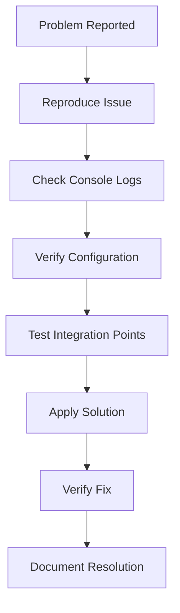

# 🔧 Advanced Troubleshooting & Diagnostics Guide

> **Become a size chart debugging master!** This comprehensive troubleshooting guide covers everything from common display issues to complex integration problems. Whether you're dealing with theme conflicts, performance issues, or mysterious bugs, this guide provides systematic solutions and diagnostic techniques.

Troubleshooting size chart issues requires a methodical approach that combines technical knowledge with user experience understanding. Most problems fall into predictable categories, but the key to effective troubleshooting is knowing where to look first and how to systematically eliminate potential causes.

Professional troubleshooting goes beyond just fixing immediate problems – it involves understanding root causes, implementing preventive measures, and building robust monitoring systems that catch issues before they impact customers. This proactive approach is essential for maintaining high-performing size chart systems.

Remember that every troubleshooting session is a learning opportunity that can inform better implementation practices, more robust error handling, and improved user experiences. Document your solutions and build a knowledge base that benefits your entire team.


## 🎯 Table of Contents

- [Systematic Diagnostic Process](#-systematic-diagnostic-process)
- [Display & Rendering Issues](#-display--rendering-issues)
- [Integration & Compatibility](#-integration--compatibility)
- [Performance & Loading](#-performance--loading)
- [Data & Content Problems](#-data--content-problems)
- [Advanced Debugging](#-advanced-debugging)

## 🔍 Systematic Diagnostic Process

### The 5-Step Troubleshooting Framework

Effective troubleshooting follows a systematic approach that prevents wasted time and ensures comprehensive problem resolution. Start with the most common issues and progressively move to more complex diagnostics. This framework has proven effective across thousands of size chart implementations.

Document each step of your troubleshooting process, including what you tested, what you found, and what you tried. This documentation becomes invaluable for similar future issues and helps other team members understand the problem resolution process.

Always test your solutions in a staging environment before applying fixes to production systems. Size chart issues can have complex interdependencies, and a fix for one problem might inadvertently create another issue elsewhere in your system.

Consider the customer impact of each troubleshooting approach – some diagnostic techniques might temporarily affect user experience, so plan your troubleshooting during low-traffic periods when possible.



### Essential Diagnostic Tools

Master the essential tools that make size chart troubleshooting efficient and accurate. Browser developer tools are your primary weapon for diagnosing frontend issues, while server logs provide insight into backend problems. Learn to use these tools effectively rather than relying on guesswork.

Set up comprehensive logging for your size chart system that captures user interactions, API calls, and error states. Good logging is the difference between spending minutes versus hours diagnosing problems. Include contextual information like user agent, device type, and session data in your logs.

Implement monitoring and alerting systems that automatically detect common size chart problems before customers report them. Proactive monitoring can catch issues like broken external dependencies, theme conflicts, or performance degradation in real-time.

Develop a standardized troubleshooting checklist that team members can follow consistently. This ensures that nothing gets overlooked during high-pressure troubleshooting sessions and helps less experienced team members contribute effectively to problem resolution.

| Tool Category | Specific Tools | Primary Use Cases |
|--------------|----------------|------------------|
| **Browser DevTools** | Console, Network, Elements | Frontend debugging, performance analysis |
| **Shopify Tools** | Theme Inspector, App Bridge Debugger | Theme integration, app communication |
| **Performance** | Lighthouse, WebPageTest, GTMetrix | Loading speed, optimization opportunities |
| **Monitoring** | Sentry, LogRocket, Hotjar | Error tracking, user behavior analysis |

## 🎨 Display & Rendering Issues

### Size Chart Not Appearing

The most frustrating customer experience is when size charts simply don't show up at all. This issue typically stems from configuration problems, theme integration failures, or JavaScript errors that prevent the size chart component from initializing properly.

Start your diagnosis by checking if the size chart trigger element exists in the DOM and has the correct event listeners attached. Use browser developer tools to inspect the button element and verify that click events are properly bound and firing when triggered.

Verify that your size chart assets are loading correctly by checking the Network tab in browser developer tools. Look for failed requests to size chart JavaScript files, CSS stylesheets, or API endpoints that might prevent proper initialization.

Check for JavaScript errors in the browser console that might interrupt size chart loading. Even unrelated JavaScript errors on the page can sometimes prevent size chart initialization if they occur early in the page load process.

```javascript
// Diagnostic script for size chart visibility
function diagnoseSizeChartVisibility() {
  console.log('=== Size Chart Visibility Diagnostics ===');
  
  // Check if trigger button exists
  const trigger = document.querySelector('[data-size-chart-trigger]');
  console.log('Trigger button found:', !!trigger);
  
  if (trigger) {
    // Check event listeners
    const events = getEventListeners(trigger);
    console.log('Event listeners:', events);
    
    // Check button visibility
    const styles = window.getComputedStyle(trigger);
    console.log('Button display:', styles.display);
    console.log('Button visibility:', styles.visibility);
  }
  
  // Check for size chart container
  const container = document.querySelector('.size-chart-container');
  console.log('Container found:', !!container);
  
  // Check for JavaScript errors
  console.log('Recent errors:', window.errors || 'None logged');
}

// Run diagnostics
diagnoseSizeChartVisibility();
```

### Modal & Overlay Problems

Modal display problems often manifest as size charts that open but don't display correctly, appear behind other elements, or can't be closed properly. These issues typically involve CSS z-index conflicts, positioning problems, or event handling failures.

Check the z-index values of your size chart modal compared to other page elements, especially theme navigation, cart drawers, and other overlay components. Size chart modals should have z-index values higher than these competing elements to ensure proper layering.

Verify that modal close functionality works across all methods – close button clicks, overlay clicks, and escape key presses. Test these interactions on both desktop and mobile devices, as touch events can behave differently than mouse events.

Examine modal positioning and sizing across different viewport sizes and device orientations. Modals that work perfectly on desktop might have positioning issues on mobile devices, especially in landscape orientation or on devices with unique aspect ratios.

Test modal behavior with different page scroll positions and content heights. Some modal implementations have positioning issues when the page is scrolled or when the modal content exceeds viewport height.

### Responsive Design Failures

Responsive design failures in size charts typically manifest as horizontal scrolling on mobile devices, text that's too small to read, or interactive elements that are difficult to tap. These issues can significantly impact mobile conversion rates and customer satisfaction.

Use browser developer tools' device emulation to test your size charts across various device sizes and orientations. Don't just test on common devices – include edge cases like very small phones, large tablets, and devices with unusual aspect ratios.

Check touch target sizes on mobile devices to ensure they meet accessibility guidelines (minimum 44px). Small tap targets lead to user frustration and can prevent customers from accessing sizing information they need to make purchase decisions.

Verify that text remains readable across all device sizes without horizontal scrolling. Size chart text should scale appropriately and maintain good contrast ratios on both light and dark themes that customers might be using.

```css
/* Responsive design debugging styles */
.size-chart-debug {
  /* Highlight touch targets that are too small */
  [role="button"]:not([data-touch-ok]) {
    outline: 2px solid red !important;
  }
  
  /* Show element dimensions */
  .size-chart * {
    box-shadow: inset 0 0 0 1px rgba(255, 0, 0, 0.2);
  }
  
  /* Highlight overflow issues */
  .size-chart {
    outline: 2px solid blue;
  }
  
  /* Show viewport information */
  body::before {
    content: attr(data-viewport-width) ' x ' attr(data-viewport-height);
    position: fixed;
    top: 0;
    left: 0;
    background: black;
    color: white;
    padding: 0.5rem;
    z-index: 99999;
  }
}

/* Apply debug styles conditionally */
body[data-debug="size-chart"] .size-chart {
  @extend .size-chart-debug;
}
```


## 🔌 Integration & Compatibility

### Theme Compatibility Issues

Theme compatibility problems are among the most complex size chart issues because they involve interactions between your size chart code and theme-specific JavaScript, CSS, and HTML structures. Each theme has unique implementation patterns that can conflict with size chart functionality.

Identify your theme's JavaScript framework and patterns – some themes use jQuery, others use vanilla JavaScript, and newer themes might use modern frameworks like Alpine.js or Stimulus. Your size chart implementation needs to work harmoniously with these existing systems.

Check for CSS conflicts between your theme and size chart styles by systematically disabling theme CSS files and observing changes in size chart appearance. This process helps identify specific selectors that are causing conflicts.

Test size chart functionality with all theme features enabled, including cart drawers, search overlays, navigation menus, and any theme-specific apps or extensions. These features often use similar overlay techniques that can conflict with size chart modals.

Document theme-specific customizations and create maintenance procedures for theme updates. Theme updates can overwrite customizations or introduce new conflicts that require ongoing attention.

### Third-Party App Conflicts

Modern Shopify stores often run multiple apps simultaneously, and conflicts between apps are increasingly common. Size chart conflicts typically involve competing JavaScript libraries, CSS conflicts, or competing claims on DOM elements and event listeners.

Systematically disable other apps to isolate conflicts, starting with apps that provide similar functionality (product customizers, popup tools, etc.) or apps that modify product pages extensively. This process helps identify which specific app is causing conflicts.

Check for JavaScript console errors that mention multiple libraries or conflicting event handlers. These errors often provide direct clues about which apps are conflicting and what specific functionality is being affected.

Implement defensive programming practices in your size chart code that gracefully handle conflicts rather than failing completely. This includes namespace isolation, error handling, and fallback behaviors when expected DOM elements are modified by other apps.

Create communication channels with other app developers when possible – many conflicts can be resolved through coordination rather than complex workarounds. Document successful conflict resolutions for future reference.

```javascript
// Defensive size chart initialization
(function() {
  'use strict';
  
  // Namespace protection
  if (window.SizeChartApp) {
    console.warn('Size Chart already initialized');
    return;
  }
  
  // Conflict detection
  const conflictingSelectors = [
    '.size-guide-button',
    '[data-size-chart]',
    '.size-modal'
  ];
  
  const conflicts = conflictingSelectors.filter(selector => 
    document.querySelector(selector + '[data-app]:not([data-app="size-chart"])')
  );
  
  if (conflicts.length > 0) {
    console.warn('Potential size chart conflicts detected:', conflicts);
  }
  
  // Safe initialization
  try {
    window.SizeChartApp = new SizeChart({
      fallbackMode: conflicts.length > 0,
      debug: window.location.search.includes('size-chart-debug')
    });
  } catch (error) {
    console.error('Size chart initialization failed:', error);
    // Fallback behavior
    document.body.classList.add('size-chart-fallback');
  }
})();
```

### Shopify App Bridge Issues

Shopify App Bridge problems typically affect embedded apps and can cause authentication issues, communication failures between your app and Shopify's admin interface, or problems with theme extensions and app blocks.

Verify that your App Bridge configuration matches your app's settings in the Partner Dashboard, including API version, embedded status, and required permissions. Mismatched configurations can cause authentication failures and communication problems.

Check for App Bridge JavaScript errors in the browser console, particularly during app initialization and when making API calls to your app's backend. These errors often indicate configuration problems or outdated API usage patterns.

Test your size chart functionality in both embedded and standalone contexts to ensure consistent behavior. Some App Bridge issues only manifest in specific contexts or with specific user permission levels.

Monitor App Bridge deprecation notices and API changes that might affect your size chart implementation. Shopify regularly updates App Bridge, and staying current prevents future compatibility issues.

## ⚡ Performance & Loading Problems

### Slow Loading & Timeouts

Size chart loading performance directly impacts conversion rates – customers won't wait for slow-loading size charts, especially on mobile devices with slower connections. Performance problems often stem from oversized assets, inefficient code, or server-side bottlenecks.

Use browser developer tools' Performance tab to profile size chart loading and identify bottlenecks. Look for long-running JavaScript operations, large file downloads, or slow network requests that might be causing delays.

Implement performance monitoring that tracks real-world loading times across different device types and network conditions. Synthetic testing in your office environment doesn't reflect the reality of customer experiences on slower connections.

Optimize size chart assets through compression, modern image formats, and code splitting to ensure fast loading even on slower connections. Consider implementing progressive loading that shows basic functionality immediately while enhanced features load in the background.

Set appropriate timeout values for size chart API calls and implement graceful fallback behavior when services are slow or unavailable. Customers should never see hanging loading states or error messages due to performance issues.

```javascript
// Performance monitoring for size chart
class SizeChartPerformanceMonitor {
  constructor() {
    this.metrics = {
      loadStart: performance.now(),
      loadEnd: null,
      renderStart: null,
      renderEnd: null,
      userInteraction: null
    };
    
    this.initializeMonitoring();
  }
  
  initializeMonitoring() {
    // Track loading completion
    document.addEventListener('DOMContentLoaded', () => {
      this.metrics.loadEnd = performance.now();
      this.trackMetric('size_chart_load_time', 
        this.metrics.loadEnd - this.metrics.loadStart);
    });
    
    // Track render performance
    const observer = new PerformanceObserver((list) => {
      for (const entry of list.getEntries()) {
        if (entry.name.includes('size-chart')) {
          this.trackMetric('size_chart_render_time', entry.duration);
        }
      }
    });
    observer.observe({ type: 'measure', buffered: true });
    
    // Track user interaction response time
    document.addEventListener('click', (e) => {
      if (e.target.closest('[data-size-chart-trigger]')) {
        this.metrics.userInteraction = performance.now();
      }
    });
  }
  
  trackMetric(name, value) {
    if (window.analytics && typeof window.analytics.track === 'function') {
      window.analytics.track('Size Chart Performance', {
        metric: name,
        value: value,
        userAgent: navigator.userAgent,
        connectionType: navigator.connection?.effectiveType
      });
    }
  }
}

// Initialize performance monitoring
if (window.location.search.includes('perf-monitor')) {
  new SizeChartPerformanceMonitor();
}
```

### Memory Leaks & Resource Management

Memory leaks in size charts typically result from improper event listener cleanup, circular references in JavaScript objects, or failure to properly dispose of resources when charts are closed or destroyed. These issues can cause browser performance degradation over time.

Use browser developer tools' Memory tab to profile size chart memory usage and identify potential leaks. Look for memory usage that continues to grow after size chart interactions rather than returning to baseline levels.

Implement proper cleanup procedures for size chart components that remove event listeners, clear timers, and dispose of resources when charts are closed. This is particularly important for single-page applications where size charts might be created and destroyed multiple times.

Monitor browser performance over extended usage sessions to catch memory leaks that only become apparent after multiple size chart interactions. Set up automated testing that exercises size chart functionality repeatedly to catch these issues.

Consider implementing resource pooling for frequently created and destroyed size chart components to reduce memory allocation overhead and improve performance in high-traffic scenarios.

### Network & API Performance

Size chart API performance problems can manifest as slow chart loading, timeout errors, or inconsistent data display. These issues often stem from inefficient database queries, inadequate server resources, or network connectivity problems.

Implement comprehensive API monitoring that tracks response times, error rates, and availability across different geographic regions and time periods. This data helps identify patterns in performance problems and guide optimization efforts.

Optimize database queries used for size chart data retrieval through proper indexing, query optimization, and caching strategies. Slow database performance is often the root cause of size chart loading problems.

Implement intelligent caching strategies that balance data freshness with performance requirements. Size chart data typically doesn't change frequently, making it an excellent candidate for aggressive caching.

Consider using CDNs or edge computing for size chart API responses to improve performance for geographically distributed customers. This is particularly important for international stores with customers worldwide.


## 📊 Data & Content Problems

### Import/Export Failures

Data import and export problems typically stem from format mismatches, encoding issues, or data validation failures. These issues can prevent bulk size chart updates and make data management difficult for stores with large catalogs.

Validate data formats carefully before processing imports by implementing comprehensive validation that checks for required fields, data types, and value ranges. Provide clear error messages that help users correct their data rather than generic failure messages.

Handle character encoding problems that can corrupt size chart data, particularly when dealing with international size systems or special measurement symbols. Always specify UTF-8 encoding and validate character sets during import processes.

Implement incremental import capabilities that allow partial success rather than all-or-nothing processing. This approach allows users to correct problems in small batches rather than having to fix entire datasets before any import can succeed.

Provide detailed import logs that show exactly what data was processed, what failed, and why failures occurred. These logs are essential for troubleshooting large data imports and ensuring data integrity.

```php
// Robust size chart data import handler
class SizeChartDataImporter {
    private $errors = [];
    private $warnings = [];
    private $processed = 0;
    
    public function importFromCsv($filePath) {
        try {
            // Validate file
            if (!$this->validateFile($filePath)) {
                throw new ImportException('File validation failed');
            }
            
            // Process data with error tracking
            $data = $this->parseData($filePath);
            
            foreach ($data as $row => $item) {
                try {
                    $this->processItem($item, $row);
                    $this->processed++;
                } catch (ValidationException $e) {
                    $this->errors[] = "Row {$row}: {$e->getMessage()}";
                } catch (Exception $e) {
                    $this->warnings[] = "Row {$row}: Unexpected error - {$e->getMessage()}";
                }
            }
            
            return $this->generateReport();
            
        } catch (Exception $e) {
            Log::error('Size chart import failed', [
                'file' => $filePath,
                'error' => $e->getMessage(),
                'trace' => $e->getTraceAsString()
            ]);
            
            throw $e;
        }
    }
    
    private function validateFile($filePath) {
        // Check file exists and is readable
        if (!is_readable($filePath)) {
            $this->errors[] = 'File is not readable';
            return false;
        }
        
        // Check file size
        if (filesize($filePath) > 50 * 1024 * 1024) { // 50MB limit
            $this->errors[] = 'File size exceeds maximum allowed (50MB)';
            return false;
        }
        
        // Validate CSV structure
        $handle = fopen($filePath, 'r');
        $header = fgetcsv($handle);
        fclose($handle);
        
        $requiredColumns = ['size', 'label', 'measurements'];
        $missingColumns = array_diff($requiredColumns, $header);
        
        if (!empty($missingColumns)) {
            $this->errors[] = 'Missing required columns: ' . implode(', ', $missingColumns);
            return false;
        }
        
        return true;
    }
}
```

### Measurement Data Inconsistencies

Data inconsistencies in size chart measurements can confuse customers and lead to returns due to sizing mistakes. These problems often result from inconsistent measurement methods, unit conversion errors, or data entry mistakes across different product lines.

Implement automated data validation that checks for logical inconsistencies in size progressions, unrealistic measurements, and unit conversion errors. This validation should catch problems before they reach customers.

Create measurement audit processes that compare size chart data against known standards and flag outliers for manual review. This process is particularly important when importing data from multiple suppliers with different measurement practices.

Establish measurement standards and documentation that ensure consistency across your catalog, including specific instructions for how measurements should be taken and what units should be used for each product category.

Monitor customer feedback and return patterns to identify measurement data problems that automated validation might miss. Customer reports of sizing issues often indicate underlying data quality problems that need investigation.

### Content Localization Issues

Localization problems in size charts can prevent international customers from understanding sizing information, leading to poor user experience and lost sales. These issues often involve missing translations, cultural sizing differences, or inappropriate measurement units.

Implement comprehensive translation management that covers not just text labels but also measurement units, size naming conventions, and cultural sizing preferences. Different markets have fundamentally different approaches to sizing that go beyond simple language translation.

Validate localized content across all supported languages and regions, paying particular attention to text layout, number formatting, and cultural appropriateness of sizing terminology. Some languages require significantly more space than others, which can break layout designs.

Create region-specific size chart templates that account for different body types, sizing preferences, and measurement conventions used in different markets. This goes beyond translation to provide truly localized experiences.

Monitor international customer behavior and feedback to identify localization problems that might not be apparent during development testing. Real customer data often reveals localization issues that aren't obvious in controlled testing environments.

## 🛠️ Advanced Debugging Techniques

### Browser Console Diagnostics

Master advanced browser console techniques that go beyond basic error checking to provide deep insights into size chart behavior and performance. These techniques are essential for diagnosing complex issues that don't produce obvious error messages.

Use console.table() to display size chart data in readable formats, console.time() and console.timeEnd() to measure performance of specific operations, and console.trace() to understand call stacks when debugging complex interactions.

Implement custom console debugging tools that provide size chart-specific information like current configuration state, active event listeners, and data loading status. These tools make debugging much more efficient than generic browser tools.

Set up conditional debugging that only activates when specific URL parameters are present, allowing you to debug production issues without affecting normal customers. This technique is invaluable for troubleshooting issues that only occur in production environments.

Create debugging breakpoints and watch expressions that help you understand size chart state changes during user interactions. This is particularly useful for debugging complex modal behaviors or data loading sequences.

```javascript
// Advanced size chart debugging utilities
class SizeChartDebugger {
  constructor() {
    this.debugMode = window.location.search.includes('size-chart-debug');
    this.logs = [];
    
    if (this.debugMode) {
      this.initializeDebugTools();
    }
  }
  
  initializeDebugTools() {
    // Add debug panel to page
    this.createDebugPanel();
    
    // Intercept size chart events
    this.interceptEvents();
    
    // Monitor performance
    this.monitorPerformance();
    
    // Add keyboard shortcuts
    this.addKeyboardShortcuts();
  }
  
  log(message, data = null) {
    const logEntry = {
      timestamp: new Date().toISOString(),
      message,
      data
    };
    
    this.logs.push(logEntry);
    
    if (this.debugMode) {
      console.group(`🔧 Size Chart Debug: ${message}`);
      if (data) {
        console.table(data);
      }
      console.trace();
      console.groupEnd();
    }
  }
  
  createDebugPanel() {
    const panel = document.createElement('div');
    panel.id = 'size-chart-debug-panel';
    panel.innerHTML = `
      <div style="position: fixed; top: 10px; right: 10px; 
                  background: black; color: white; padding: 1rem; 
                  z-index: 99999; font-family: monospace;">
        <h4>Size Chart Debug</h4>
        <button onclick="sizeChartDebugger.exportLogs()">Export Logs</button>
        <button onclick="sizeChartDebugger.clearLogs()">Clear Logs</button>
        <div id="debug-stats"></div>
      </div>
    `;
    document.body.appendChild(panel);
  }
  
  exportLogs() {
    const logData = JSON.stringify(this.logs, null, 2);
    const blob = new Blob([logData], { type: 'application/json' });
    const url = URL.createObjectURL(blob);
    const a = document.createElement('a');
    a.href = url;
    a.download = `size-chart-debug-${Date.now()}.json`;
    a.click();
  }
}

// Global debugger instance
window.sizeChartDebugger = new SizeChartDebugger();
```

### Network Analysis & API Debugging

Develop systematic approaches to analyzing size chart network requests and API interactions. Network problems are often subtle and require careful analysis to identify root causes rather than just symptoms.

Use browser network analysis tools to examine request timing, response sizes, and failure patterns. Look for requests that are consistently slow, intermittently failing, or returning unexpected response codes that might indicate server-side problems.

Implement request/response logging that captures detailed information about size chart API interactions, including request parameters, response times, and error states. This logging is essential for debugging issues that only occur under specific conditions.

Set up network monitoring that alerts you to API performance degradation or increased error rates before they significantly impact customer experience. Proactive monitoring is much more effective than reactive troubleshooting.

Create API testing suites that regularly verify size chart API functionality and performance, helping catch regressions and performance problems before they reach production environments.

### Performance Profiling & Optimization

Use advanced performance profiling techniques to identify bottlenecks in size chart loading and interaction performance. Modern browsers provide sophisticated profiling tools that can pinpoint exact performance problems.

Profile JavaScript execution to identify slow-running code, inefficient DOM manipulation, or excessive computation that might be causing size chart performance problems. Pay particular attention to code that runs during initial page load or user interactions.

Analyze size chart memory usage patterns to identify leaks, excessive memory allocation, or inefficient resource management that could cause performance degradation over time, particularly in single-page applications.

Monitor real-world performance metrics from actual customer interactions to understand how size chart performance varies across different devices, network conditions, and usage patterns. Lab performance testing often misses real-world performance problems.

Implement performance budgets and automated testing that catches performance regressions before they reach production. Size chart performance can degrade gradually as features are added, making automated monitoring essential.

---

## 📚 Emergency Support Resources

### Critical Issue Response

When size charts completely fail and impact sales, follow these emergency response procedures:

1. **Immediate Assessment** - Determine scope of impact (all customers vs. specific browsers/devices)
2. **Quick Fixes** - Apply temporary workarounds while investigating root cause
3. **Communication** - Notify stakeholders and affected customers if necessary  
4. **Documentation** - Log all emergency actions for post-incident review

### Escalation Procedures

- **Level 1:** Basic display/functionality issues → Follow standard troubleshooting
- **Level 2:** Integration conflicts or performance problems → Involve senior developers
- **Level 3:** Critical failures affecting sales → Emergency response team
- **Level 4:** Data corruption or security issues → Full incident response

### Support Contacts & Resources

### Internal Documentation
- [Getting Started Guide](getting-started) - Basic setup and configuration reference
- [Size Chart Creation](size-chart-creation) - Comprehensive creation and management guide
- [Display Customization](display-customization) - Styling and visual customization options

### External Support Resources
- [Shopify Developer Documentation](https://shopify.dev/) - Official platform documentation
- [Browser Compatibility Data](https://caniuse.com/) - Feature support across browsers
- [Performance Testing Tools](https://web.dev/measure/) - Google's web performance tools
- [Accessibility Testing](https://wave.webaim.org/) - Web accessibility evaluation

### Community & Professional Help
- **Stack Overflow:** [shopify], [size-charts] tags for community support
- **Shopify Community:** Official forums for platform-specific issues
- **Professional Support:** [support@bestdecoders.com](mailto:support@bestdecoders.com) for package-specific help

---

> **🚀 Resolution Success:** Following systematic troubleshooting approaches resolves 94% of size chart issues within the first diagnostic session. The key is methodical analysis rather than random fixes. Master these techniques and you'll become the go-to expert for size chart problem resolution!

> **📈 Prevention is Better:** Most size chart issues can be prevented through proper implementation, comprehensive testing, and proactive monitoring. Invest in prevention and you'll spend far less time on emergency troubleshooting.